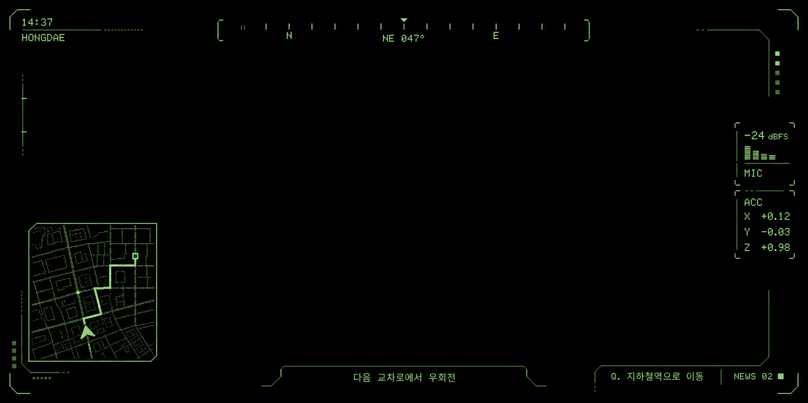

# Sandevistan

<p align="center">
  <strong>A fast, glanceable tactical HUD for Even Realities G2.</strong>
</p>

<p align="center">
  
  
  
  
  
  
  
</p>



Sandevistan is an unofficial, fan-made personal HUD for the Even Realities G2.
It renders a 576×288 tactical interface to Canvas, splits it into four 288×144
images, and sends those tiles to the glasses in a measured serial sequence. The
current product candidate is `/hud-canvas-fast`.

The project favors useful information, predictable controls, and hardware-proven
behavior over browser-only effects. It has been tested on physical G2 glasses
with the Even Hub SDK pinned to `0.0.11`.

## Table of contents

- [Why Sandevistan](#why-sandevistan)
- [HUD pages](#hud-pages)
- [Interaction model](#interaction-model)
- [Transport design](#transport-design)
- [Live data](#live-data)
- [Optional navigation](#optional-navigation)
- [Local development](#local-development)
- [Build, test, and package](#build-test-and-package)
- [Project structure](#project-structure)
- [Compatibility and SDK 0.0.12 reproduction](#compatibility-and-sdk-0012-reproduction)
- [Privacy, attribution, and limitations](#privacy-attribution-and-limitations)
- [Contributing](#contributing)
- [License and trademarks](#license-and-trademarks)

## Why Sandevistan

G2 is a constrained display, not a miniature phone. Sandevistan is designed
around that fact:

- Large, high-contrast typography that remains legible on the optical display.
- Dense overview information distributed across four focused pages.
- Full-screen detail decks for maps, news, tasks, weather, and navigation.
- Canvas-first rendering for visual consistency and fast page changes.
- Serial, fail-fast image transport with no deferred refresh queue.
- Keyless location, weather, news, and map data.
- Optional server-side OpenRouteService routing with no key in the client.
- A browser preview and trace console for diagnosing physical-hardware behavior.

## HUD pages

The dashboard keeps a 288×288 live map on the left and a page-specific
information panel on the right.

| Page | Purpose |
| --- | --- |
| `OVERVIEW` | Local time, full date, current weather, and the connected device battery |
| `NEWS` | Up to six current SBS RSS headlines |
| `TODO` | Three persistent checklist items and today's completion progress |
| `NAVIGATION` | Route state, remaining distance, next maneuver, and destination |

A single tap opens the active page's four-tile detail deck:

- `OVERVIEW` opens the full-screen map.
- `NEWS` opens one real RSS story at a time with paginated body text.
- `TODO` opens the full checklist and selected item.
- `NAVIGATION` opens the current maneuver and route progress.
- The weather detail view concentrates on current conditions, hourly context,
  and a large tactical weather icon.

## Interaction model

The same gestures work from the G2 temple and the R1 ring:

- **Scroll:** move between dashboard pages.
- **Single tap:** open the active detail deck or activate its selected item.
- **Fast double tap:** return from a detail deck to its dashboard page.
- **Dashboard double tap:** replace all tiles with black images while leaving
  the app and event listeners alive; double tap again to restore the latest view.

Within full-screen details:

- News scrolls through the current article body before advancing to another story.
- TODO scroll selects an item; tapping toggles it in either direction.
- Navigation scroll selects route instructions; tapping returns to the active step.
- Map scroll direction is reserved for zoom: down zooms in and up zooms out.

The map zoom radius is remembered across dashboard, detail, and location updates:
`850m`, `650m`, `500m`, `375m`, or `280m`.

## Transport design

The display is divided into four named G2 image containers:

| Container | Image ID | Bounds |
| --- | ---: | --- |
| `sandevistanTL` | 2 | left, top — 288×144 |
| `sandevistanTR` | 3 | right, top — 288×144 |
| `sandevistanBL` | 4 | left, bottom — 288×144 |
| `sandevistanBR` | 5 | right, bottom — 288×144 |

The hardware-proven send order is:

- Initial display, restore, and full-screen detail: `3 → 5 → 2 → 4`.
- Dashboard page change: right side only, `3 → 5`.
- Map movement: left side only, `2 → 4`.
- Visible minute or battery change: top-right only, `3`.

Only one accepted refresh owns the transport at a time. Tiles are sent serially
inside that refresh. A tile whose encoded bytes match the last successful send is
skipped. Any refresh request arriving while transport is busy is dropped
immediately: it is not queued, merged, replayed, or retried. A failed refresh
remains failed and the next independent event may try again.

This policy replaced an earlier backlog design that could accumulate tens of
thousands of stale minute and location operations and eventually freeze the
WebView.

## Live data

Core features do not require an API key.

| Feature | Source | Refresh policy |
| --- | --- | --- |
| Current location | Even Hub SDK | Initial reading, then accepted at `15s / 15m` |
| Weather | [Open-Meteo](https://open-meteo.com/) | 15-minute cache plus foreground recheck |
| News | Allowlisted SBS RSS through same-origin API | Progressive library up to 100 stories; one-hour refill while idle |
| Roads and place labels | [OpenStreetMap](https://www.openstreetmap.org/copyright) via Overpass | When the rounded location cell changes |
| Clock | Local device time | Minute boundary, skipped if that minute was already rendered |
| Battery | Even SDK device-state event | Only when the visible value changes |

If live position is unavailable, Sandevistan uses a recent cached position. If
there is no cached position, the HUD clearly identifies demo data instead of
presenting it as live. Missing map data renders `NO DATA`; missing GPS renders
`NO GPS DATA`. A location without a heading uses a hollow position circle rather
than a directional arrow.

Weather, news, and map failures retain the last successful value as stale data.
RSS and Overpass access use fixed same-origin server routes and never accept an
arbitrary upstream URL.

Persistent values use the `sandevistan:*:v1` local-storage namespace.

## Optional navigation

Only destination search and route calculation require a key. Set
`ORS_API_KEY` in the server process to enable OpenRouteService. The key is never
read from Vite client variables and is not included in source, browser responses,
logs, or the EHPK package.

Without a key, location, weather, news, and the OSM map continue to work. Routing
controls stay out of the way rather than occupying a disabled HUD panel.

With a key, the companion WebView can search Korean destinations and request
walking, cycling, or driving routes. During active guidance, location sampling
increases to `2s / 5m`. Three consecutive positions at least 35m off route trigger
a recalculation, limited to one request every 30 seconds. Ending guidance clears
the route and restores the normal `15s / 15m` location policy.

Recent routes are stored for at most six hours and return as stale context; the
app never resumes guidance automatically.

## Local development

Requirements:

- Node.js 22 or newer.
- npm.
- Even Realities app with Even Hub access for physical G2 transport.
- Tailscale or another phone-accessible local network when testing on hardware.

Install dependencies:

```bash
npm install
```

Start the development server:

```bash
npm run dev -- --host 0.0.0.0 --port 4176 --strictPort
```

Enable routing only when needed:

```bash
ORS_API_KEY='<server-only-key>' \
  npm run dev -- --host 0.0.0.0 --port 4176 --strictPort
```

Open the app through **Even Hub → Scan QR**:

```text
http://<PHONE-REACHABLE-IP>:4176/hud-canvas-fast?sdk=0.0.11&build=<BUILD-ID>
```

You can generate the configured QR code with:

```bash
npm run qr
```

A normal desktop or mobile browser shows the Canvas preview. G2 transfer starts
only when the page is opened through the Even app bridge.

## Build, test, and package

All test execution is serial to avoid resource contention with the G2
development environment.

```bash
npm test
npm run test:repo
npm run typecheck
npm run build
npm run test:sites
node --test --test-concurrency=1 \
  tests/api-router.test.mjs \
  tests/map-api.test.mjs \
  tests/news-api.test.mjs \
  tests/route-api.test.mjs
git diff --check
```

Confirm that the client cannot access the ORS secret:

```bash
git grep -n "ORS_API_KEY" -- src app.json package.json
```

Build an Even Hub package locally:

```bash
npm run pack
```

The resulting `sandevistan.ehpk` is a local artifact. The npm package is marked
`private`, and this repository does not publish to npm or Even Hub.

## Project structure

```text
src/                     React preview, Canvas renderers, G2 transport, live state
server/                  Same-origin weather, news, map, and optional route APIs
tests/                   Node tests for API and production-worker behavior
scripts/                 Build preparation and repository policy checks
docs/design/             Selected HUD visual direction
docs/hardware/           Physical G2 checkpoints and measured transport records
docs/research/           Even Hub and G2 constraint research
docs/superpowers/        Historical design specifications and implementation plans
app.json                 Even Hub application manifest
```

Preserved diagnostic routes include:

- `/hud-canvas` — original four-tile Canvas HUD.
- `/hud-hybrid` — Canvas plus native Text layer experiment.
- `/hud-hybrid-z` — explicit Text z-order experiment.
- `/calibration-max` — 576×288 display-boundary calibration.
- `/diagnostic-v10` — tap-to-send 1-bit BMP transport diagnostic.

## Compatibility and SDK 0.0.12 reproduction

| SDK | Physical G2 result | Status |
| --- | --- | --- |
| `0.0.11` | Four-tile serial image transport works | Supported and pinned |
| `0.0.12` | First tile returns `sendFailed` in roughly 7ms; no image appears | Isolated reproduction only |

SDK `0.0.12` adds a `compressMode: 2` path that is incompatible with the tested
Even app and glasses combination. The minimal failing code remains available on
the unchanged
[`0.0.12-reproduce`](https://github.com/hmmhmmhm/sandevistan/tree/0.0.12-reproduce)
branch for the Even Realities team. Main remains pinned to `0.0.11`.

Useful hardware records:

- [First successful G2 image transfer](docs/hardware/2026-07-26-first-g2-image-success.md)
- [SDK 0.0.11 transport checkpoint](docs/hardware/2026-07-27-sdk-0011-transport-success.md)
- [SDK 0.0.12 LZ4 experiment](docs/hardware/2026-07-28-sdk-0012-lz4-experiment.md)
- [Unchanged-tile skip experiment](docs/hardware/2026-07-28-g2-unchanged-tile-skip.md)
- [Project completion audit](docs/hardware/2026-07-27-project-completion-audit.md)

## Privacy, attribution, and limitations

- Location, task, route, and cache data are stored through the Even local-storage
  bridge on the user's device.
- Requests to Open-Meteo, SBS RSS, OpenStreetMap/Overpass, and optional
  OpenRouteService necessarily disclose request data to those services.
- OpenStreetMap data is © OpenStreetMap contributors and available under the
  [ODbL](https://www.openstreetmap.org/copyright).
- Public endpoints are used conservatively for a personal, non-commercial
  prototype. This is not a hosted multi-user service.
- The black-tile display toggle is not an official G2 sleep mode; the app and
  listeners continue running.
- Hardware timing varies with the phone, Even app, glasses state, and radio link.

## Contributing

Issues and focused pull requests are welcome. Before opening a change:

1. Keep image transport serial and fail-fast.
2. Do not add a deferred refresh queue.
3. Keep credentials on the server.
4. Preserve the 576×288 and 288×144 transport boundaries.
5. Run the complete serial verification suite above.
6. Keep tracked Markdown in English.

## License and trademarks

The source code is available under the [MIT License](LICENSE).

Sandevistan is an unofficial fan project. It is not affiliated with, endorsed by,
or sponsored by CD PROJEKT RED, the Cyberpunk franchise, Even Realities, or their
respective owners. “Cyberpunk 2077,” “Sandevistan,” “Even Realities,” and related
names and marks belong to their respective owners. This repository includes no
game logo, extracted game UI, or proprietary game asset.
